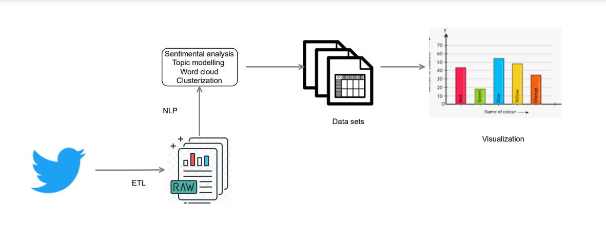

# Sentiment analysis of conversations on twitter in Python.

### COMPONNETS:
- ETL data tweets
- Analizer sentiments
- data set
- Data viz
## Install requirements
install requirements general
>> pip install --upgrade pip && pip install --upgrade pip; pip install -r requirements.txt
## Install NLTK terminal  
install dependencies nltk
>> python 
>> import nltk
>> nltk.download('vader_lexicon')

### Install  IDENTIFY LANGUAGE TETX NLP
Download LanguageDetector
>> python -m spacy download en_core_web_sm

### run the tweet harvesting script by keyword
example
>> python app/scripts/get_tweets_search.py -k="Elon Musk"
